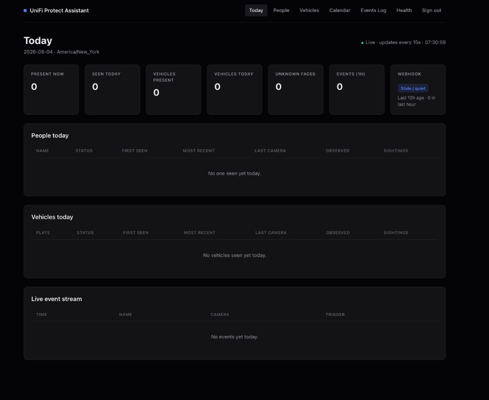

# UniFi Protect Assistant

Private Cloudflare Workers dashboard for UniFi Protect face and vehicle events, reporting, and presence tracking.

[](https://www.typescriptlang.org/)
[](https://developers.cloudflare.com/workers/)
[](https://github.com/andrewtryder/unifi-protect-assistant/actions/workflows/deploy.yml)
[](LICENSE)



## What it is

UniFi Protect Assistant receives alarm webhooks from a UniFi Protect NVR, normalizes face and (when enabled) vehicle/license-plate events, and stores them in Cloudflare D1. A private, server-rendered dashboard shows who and which plates were seen today, people and vehicle history, calendar and event logs, and basic health diagnostics.

Presence sessions and daily person reports are computed for faces (live on Today; materialized for history via a daily cron). Vehicle visit stats are derived on-read from stored plate events. Dashboard routes sit behind Cloudflare Access and an email allowlist; the UniFi webhook path is separate and protected by a shared secret (`X-Webhook-Secret`).

## Features

- Live **Today** dashboard (people, vehicles, webhook health, event stream)
- Known and unknown face events
- Known vehicle / license-plate events (when enabled)
- People directory and profiles; vehicle directory and profiles
- Calendar history (people) and day event logs (people and vehicles)
- Presence-session reporting for people
- Health and ingestion diagnostics
- Scheduled data-retention cleanup
- Cloudflare Access protection for the dashboard
- Mobile-friendly server-rendered UI

## How it works

```text
UniFi Protect
    |
    | HTTPS webhook (POST /unifi)
    v
Cloudflare Worker
    |
    +-- D1 event storage
    +-- KV operational state
    +-- Scheduled reports and cleanup
    +-- Private dashboard behind Cloudflare Access
```

Protect alarms post to the Worker. The Worker authenticates the webhook, stores a raw notification, writes normalized face/vehicle rows, and serves the Access-gated UI. A daily cron builds yesterday’s person sessions/reports and applies retention.

## Quick start

**Prerequisites:** Node.js 24+, a Cloudflare account, [Wrangler](https://developers.cloudflare.com/workers/wrangler/), and D1 + KV bindings configured in `wrangler.toml` (create resources with Wrangler, then paste their IDs — do not copy IDs from someone else’s deploy).

```bash
git clone https://github.com/andrewtryder/unifi-protect-assistant.git
cd unifi-protect-assistant
npm ci
```

Copy [`.env.example`](.env.example) to `.env` (Cloudflare CLI / Access provisioning) and to `.dev.vars` (Worker secrets for local `wrangler dev`). Fill in placeholders; never commit real values.

```bash
npm run db:migrate:local
npm run dev
```

Run the full local quality gate (typecheck, lint, Prettier, tests with coverage):

```bash
npm run check
```

For local UI without Access JWTs, set `ALLOW_LOCAL_AUTH_BYPASS=true` in `.dev.vars` on `localhost` only.

## Configuration

See [`.env.example`](.env.example) and `wrangler.toml` `[vars]` for names and defaults. Do not commit secrets.

### Required production configuration

| Name                    | Role                                                 |
| ----------------------- | ---------------------------------------------------- |
| `WEBHOOK_SECRET`        | Shared secret for `POST /unifi` (`X-Webhook-Secret`) |
| `ALLOWED_EMAILS`        | Exact-email allowlist (Access policy + Worker JWT)   |
| `CF_ACCESS_TEAM_DOMAIN` | Access team domain (JWKS / issuer)                   |
| `CF_ACCESS_AUD`         | Access application audience tag                      |

| Name                  | Role                                                            |
| --------------------- | --------------------------------------------------------------- |
| `HONEYBADGER_API_KEY` | Optional. Error reporting; missing key is a health warning only |

### Common application settings

| Name                     | Role                                              |
| ------------------------ | ------------------------------------------------- |
| `TIMEZONE`               | Local calendar dates / cron day boundaries        |
| `ENABLE_VEHICLE_EVENTS`  | When `true`, ingest license-plate triggers        |
| `MAX_WEBHOOK_BODY_BYTES` | Webhook body size limit                           |
| `PRESENCE_GAP_MINUTES`   | Gap before a new presence session (default `20`)  |
| `TARGET_PERSON_NAMES`    | Optional ingestion filter (comma-separated names) |
| `TARGET_PERSON_IDS`      | Optional ingestion filter (UniFi face IDs)        |
| `WATCH_CAMERA_IDS`       | Optional camera allowlist                         |

### Local-only settings

| Name                      | Role                                                      |
| ------------------------- | --------------------------------------------------------- |
| `ALLOW_INSECURE_WEBHOOKS` | Allow `/unifi` without a secret — **never in production** |
| `ALLOW_LOCAL_AUTH_BYPASS` | Skip Access JWT on localhost — **never in production**    |

More detail: [docs/cloudflare-access.md](docs/cloudflare-access.md), [docs/deployment.md](docs/deployment.md).

## UniFi Protect webhook

In Protect **Alarm Manager**, add a webhook action:

| Setting | Value                                     |
| ------- | ----------------------------------------- |
| Method  | `POST`                                    |
| URL     | `https://<your-worker>.workers.dev/unifi` |
| Header  | `X-Webhook-Secret: <your secret>`         |

Configure alarms for the face and/or license-plate triggers you want stored. What appears in the app depends on those alarms. Vehicle ingestion also requires `ENABLE_VEHICLE_EVENTS=true`.

Optional detection thumbnails are stored when Protect includes image data in the payload. Prefer sending only the plate subset you care about.

Details and HTTP status meanings: [docs/unifi-webhooks.md](docs/unifi-webhooks.md).

## Deployment

Runs on **Cloudflare Workers** with **D1**, **KV**, **Access**, and a daily cron. Production deploys typically go through GitHub Actions on `main` (quality checks, Access provisioning, remote migrations, deploy, smoke). You can also deploy manually:

```bash
# Export / back up production D1 before applying migrations
npx wrangler d1 export unifi_protect_db --remote --output backup.sql

npm run db:migrate:prod
npm run deploy
```

See [docs/deployment.md](docs/deployment.md).

## Security and privacy

- The dashboard and JSON APIs require **Cloudflare Access**; only emails in `ALLOWED_EMAILS` may use them.
- `POST /unifi` uses `X-Webhook-Secret` (fail closed if the secret is missing, unless local insecure mode is on).
- Face images, names, and license plates are sensitive; keep Access allowlists tight.
- Do not commit `.env`, `.dev.vars`, or real secrets. Prefer placeholders from `.env.example`.
- Raw payloads/images are scrubbed on a shorter schedule than normalized rows; see [docs/database-and-retention.md](docs/database-and-retention.md).
- Avoid putting secrets, full plates, tokens, or private images in logs, screenshots, or issues.

## Development

```bash
npm run typecheck
npm run lint
npm run format:check
npm test                 # unit + integration
npm run test:coverage
npm run check            # typecheck + lint + format + coverage
npm run test:integration
npm run db:migrate:local
```

Husky runs `npm run check` on pre-commit after `npm install` / `npm ci`.

Troubleshooting common webhook, Access, and UI gaps: [docs/troubleshooting.md](docs/troubleshooting.md).

## Documentation

| Doc                                                      | Topic                                   |
| -------------------------------------------------------- | --------------------------------------- |
| [Deployment](docs/deployment.md)                         | CI/CD, secrets, migrations, backups     |
| [Cloudflare Access](docs/cloudflare-access.md)           | Allowlist, JWT checks, path bypasses    |
| [UniFi webhooks](docs/unifi-webhooks.md)                 | Alarm setup, status codes, vehicles     |
| [Database and retention](docs/database-and-retention.md) | Sessions, reports, scrub/delete windows |
| [Troubleshooting](docs/troubleshooting.md)               | Stale webhook, 401/503, missing events  |

## Status

This is a focused personal deployment rather than a general-purpose UniFi Protect integration platform. Configuration and payload formats may vary between UniFi Protect versions.

## License

[MIT](LICENSE)
